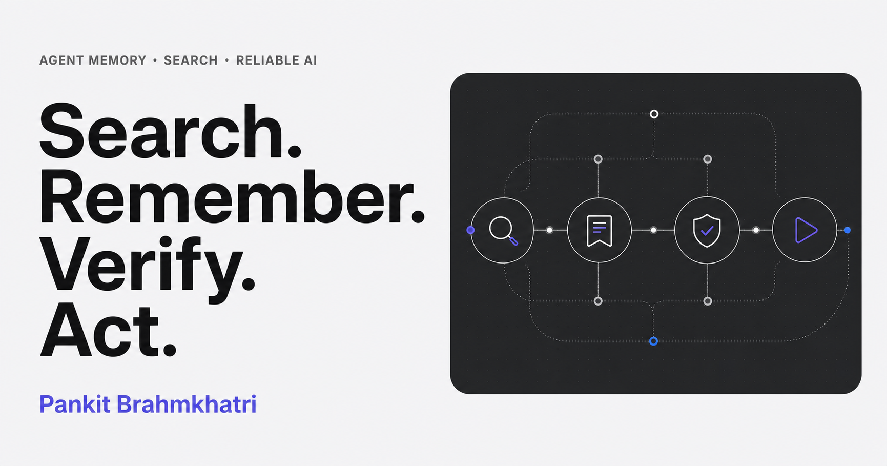

# Pankit Brahmkhatri — research portfolio

An evidence-grounded portfolio for research projects in agent memory,
retrieval, verification, test-time learning, search-guided reasoning, and
reliable tool-using systems.

The site combines a browsable catalogue of 29 verified public repositories,
five manually curated title-only shortlist entries, and a portfolio research
guide. Repository facts come from an explicit allowlist and approved sources;
the chat returns source cards, preserves project limitations, and abstains when
the indexed evidence is insufficient.



## What is included

- Responsive home, portfolio, project, writing, privacy, sitemap, robots, and
  RSS routes.
- Curated project categories, rankings, aliases, status, and related work.
- Build-time generated metadata, knowledge chunks, provenance manifests, and
  search index.
- Grounded chat with deterministic mock mode and live Cloudflare Workers AI.
- Optional Turnstile verification and optional KV-backed distributed rate
  limiting.
- Light and dark themes, keyboard-complete interactions, accessible streaming
  states, and device-local conversation history.
- Content-boundary, render, API, and end-to-end quality gates.

The exact repository boundary is documented in
[docs/project-content-matrix.md](docs/project-content-matrix.md).

## Runtime

This project uses the bundled **vinext/Vite Cloudflare Worker starter**.
vinext preserves the Next.js App Router programming model—routes under `app/`,
React Server Components, layouts, metadata, and route handlers—while Vite and
the Cloudflare plugin produce a Worker-compatible ES module.

It does **not** use OpenNext, `@opennextjs/cloudflare`, or a standard
`next build` conversion. Do not add OpenNext configuration alongside this
runtime.

See [docs/architecture.md](docs/architecture.md) for the request and build-time
data flows.

## Prerequisites

- Node.js 22.13.0 or newer.
- npm and the committed lockfile.
- No provider credential for local mock mode.
- A Cloudflare account with Workers AI for live chat or direct deployment.

## Quick start

```bash
npm ci
cp .env.example .env.local
npm run dev
```

PowerShell:

```powershell
Copy-Item .env.example .env.local
npm run dev
```

The environment template enables deterministic chat:

```dotenv
CHAT_MOCK_MODE=true
```

Mock mode exercises validation, retrieval, sources, and the chat UI without
calling Workers AI. Switch it off only when the `AI` binding is available.

## Environment and bindings

| Name                             | Visibility          | Required                  | Purpose                                                               |
| -------------------------------- | ------------------- | ------------------------- | --------------------------------------------------------------------- |
| `CHAT_MOCK_MODE`                 | Server              | Yes                       | `true` for deterministic no-provider chat; `false` for Workers AI     |
| `AI_MODEL`                       | Server              | Live mode                 | Workers AI model identifier                                           |
| `AI`                             | Worker binding      | Live mode                 | Workers AI inference                                                  |
| `RATE_LIMIT_KV`                  | Worker binding      | No                        | Shared rate-limit counters across Worker isolates                     |
| `RATE_LIMIT_MAX_REQUESTS`        | Server              | Yes                       | Requests allowed in a window                                          |
| `RATE_LIMIT_WINDOW_SECONDS`      | Server              | Yes                       | Rate-limit window length                                              |
| `NEXT_PUBLIC_TURNSTILE_SITE_KEY` | Public client value | No                        | Renders the optional Turnstile widget                                 |
| `TURNSTILE_SECRET_KEY`           | Server secret       | Paired with site key      | Validates Turnstile tokens through Siteverify                         |
| `IP_HASH_SALT`                   | Server secret       | Recommended in production | Separates one-way rate-limit identifiers from raw network identifiers |
| `NEXT_PUBLIC_SITE_URL`           | Public build value  | Production                | Canonical origin for metadata and origin checks                       |

Never place a secret in a `NEXT_PUBLIC_` variable. Live chat uses a Workers AI
binding and does not require a provider API key in the application.

## Commands

| Command                  | Purpose                                                               |
| ------------------------ | --------------------------------------------------------------------- |
| `npm run dev`            | Start the vinext/Vite development server                              |
| `npm run build`          | Produce the production vinext Worker output                           |
| `npm run start`          | Run the built application locally                                     |
| `npm run preview`        | Run the previously built production-style preview                     |
| `npm run deploy`         | Build and deploy through the configured vinext/Cloudflare Worker path |
| `npm run format:check`   | Verify formatting without rewriting files                             |
| `npm run lint`           | Run static lint checks                                                |
| `npm run typecheck`      | Run TypeScript without emitting files                                 |
| `npm test`               | Run the unit and integration suite                                    |
| `npm run test:coverage`  | Run tests with the repository coverage policy                         |
| `npm run test:a11y`      | Run automated accessibility checks                                    |
| `npm run verify:content` | Validate generated content, provenance, allowlist, and exclusions     |
| `npm run verify:links`   | Validate approved internal and public link shapes                     |
| `npm run test:e2e`       | Exercise user-visible routes and chat contracts end to end            |
| `npm run sync:github`    | Refresh trusted metadata for exact allowlist members                  |
| `npm run build:index`    | Rebuild deterministic knowledge chunks and search artifacts           |
| `npm run eval:chat`      | Run the versioned grounded-chat evaluation set                        |
| `npm run verify`         | Run the aggregate repository release verification                     |

Run the complete release gate:

```bash
npm run format:check
npm run lint
npm run typecheck
npm test
npm run verify:content
npm run verify:links
npm run build
npm run test:e2e
npm run test:a11y
npm run eval:chat
npm run verify
```

## Content model

Manual records are authoritative:

- `data/projects.ts`
- `data/ranked-projects.ts`
- `data/project-allowlist.ts`
- `data/project-exclusions.ts`
- `data/content-exclusions.ts`
- `data/project-aliases.ts`

Derived artifacts live under `generated/`:

- `github-projects.json`
- `source-manifest.json`
- `knowledge-chunks.json`
- `search-index.json`
- `corpus-version.json`
- `assets-manifest.json`

Source precedence is:

1. manual curated records and exclusion policy;
2. approved local README and documentation content;
3. trusted GitHub repository metadata.

Generated metadata never overwrites a curated description, category, featured
choice, or ranking. The allowlist gate runs first, explicit project exclusions
override aliases and discovery, and semantic content exclusions remove
out-of-scope personal or organizational material.

Sibling repositories are read as text sources only. Their code is never
executed by content generation or by the deployed site.

See [docs/content-editing.md](docs/content-editing.md) before changing project
copy or the corpus.

## Chat contract

The browser sends questions to `POST /api/chat`; deployment checks can inspect
`GET /api/health`. The chat:

- accepts a bounded question and short recent history;
- retrieves only from committed allowlisted knowledge chunks;
- treats retrieved repository text as untrusted evidence, never instructions;
- preserves caveats and distinguishes implementation from research validation;
- returns structured public source cards;
- narrows or abstains when evidence is absent;
- supports cancellation and deterministic mock responses.

Conversation history is stored in the browser for convenience and can be
cleared from the interface. Live questions and selected evidence are processed
by the Worker and Workers AI. The application does not need a portfolio-owned
conversation database, but Cloudflare account logging and retention settings
still apply.

See [docs/chat-grounding.md](docs/chat-grounding.md) and
[docs/chat-evaluation.md](docs/chat-evaluation.md).

## Cloudflare setup

The committed `wrangler.jsonc` declares the `AI` binding and the vinext Worker
entry. For live local or direct Cloudflare work:

```bash
npx wrangler login
npx wrangler whoami
npm run build
npx wrangler deploy --env production
```

Optional distributed rate limiting:

```bash
npx wrangler kv namespace create RATE_LIMIT_KV
npx wrangler types cloudflare-env.d.ts --include-runtime false
```

After namespace creation, place the returned ID in the commented
production `RATE_LIMIT_KV` block in `wrangler.jsonc`.

Optional production secrets:

```bash
npx wrangler secret put TURNSTILE_SECRET_KEY --env production
npx wrangler secret put IP_HASH_SALT --env production
```

The public Turnstile site key and canonical URL are build-time variables. A
Turnstile widget is not protection by itself; the server must verify every
token through Siteverify.

For connected Sites publishing, `.openai/hosting.json` stores only the Sites
project metadata and supported managed-resource declarations. Runtime values
are configured through the Sites project. For direct GitHub publishing,
configure the protected `production` environment described in
[docs/deployment.md](docs/deployment.md).

The package-level deployment shortcut runs the configured production path:

```bash
npm run deploy
```

## Documentation

- [Architecture](docs/architecture.md)
- [Project content matrix](docs/project-content-matrix.md)
- [Chat grounding](docs/chat-grounding.md)
- [Design system](docs/design-system.md)
- [Content editing](docs/content-editing.md)
- [Deployment](docs/deployment.md)
- [Chat evaluation](docs/chat-evaluation.md)

## Privacy and security summary

- Hard allowlist and explicit exclusions constrain both display and retrieval.
- Secrets are server-only; source cards never reveal local paths.
- Turnstile is verified server-side when configured.
- KV-backed rate limiting is optional; without KV, isolation-local limits are
  explicitly treated as best effort.
- User input and retrieved text cannot authorize tools, expand sources, or
  override system rules.
- Unsupported facts, missing sources, and out-of-scope questions result in a
  bounded explanation instead of a guessed answer.

See the application privacy route and the architecture document for the full
operational boundary.

## License

The portfolio application is available under the [MIT License](LICENSE).
Content imported or summarized from sibling repositories remains subject to the
license and claim boundaries of its source repository.
