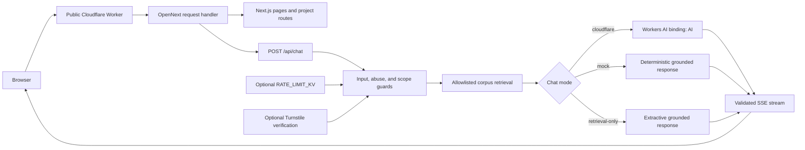
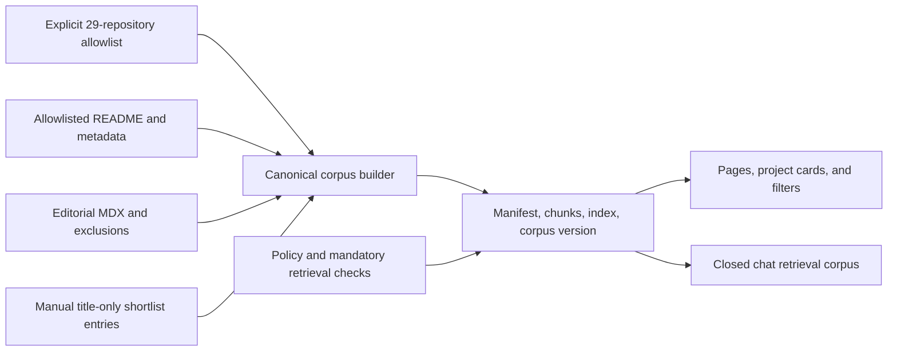

# Architecture

This portfolio is a Next.js App Router application with a grounded research
chat. `@opennextjs/cloudflare` transforms the standard Next.js build for the
Cloudflare Workers runtime. The committed OpenNext and Wrangler configuration
is the source of truth for local preview, CI, and production deployment.

## Runtime truth

The application uses standard App Router semantics:

- file-system routes under `app/`;
- server and client component boundaries;
- route handlers such as `app/api/chat/route.ts`;
- metadata, layouts, loading states, and server-side rendering.

`next build` produces `.next/`. The OpenNext build then adapts that output into
`.open-next/worker.js` and `.open-next/assets`. Wrangler serves the adapted
artifact in the local `workerd` runtime and publishes the same artifact to the
public Cloudflare Worker.

Server code uses the Next.js Node.js runtime. `next.config.ts` initializes
OpenNext binding support for `next dev`, and server routes obtain bindings
through `getCloudflareContext()` from `@opennextjs/cloudflare`. Direct
`cloudflare:workers` imports and `runtime = "edge"` declarations do not belong
in application routes.

## System view

## Build-time content flow

Portfolio content is assembled before deployment:

The application never scans arbitrary repositories at request time and never
executes sibling code. A repository outside the allowlist is not eligible for
repository-derived display or chat evidence. The five manual title-only
shortlist entries may expose only their curated rank, project number, and
title; they do not authorize repository ingestion or detailed claims. Explicit
exclusions are enforced before all other source rules.

See [Project content matrix](project-content-matrix.md) and
[Content editing](content-editing.md) for the concrete boundary and update
workflow.

## Request lifecycle

### Portfolio pages

1. The public `workers.dev` route receives the request.
2. The OpenNext Worker resolves the App Router route.
3. Server components read committed portfolio data.
4. Client components hydrate only the interactions that need browser state,
   such as filters, theme selection, and the chat composer.
5. Static assets are served from `.open-next/assets` through the `ASSETS`
   binding. Fingerprinted `/_next/static/*` assets carry immutable caching.

### Chat

1. The browser sends a question of at most 700 characters, no more than six
   recent history items, and an optional Turnstile token to `POST /api/chat`.
2. The route validates shape and size, applies abuse controls, and rejects
   unsupported methods or content types.
3. Retrieval selects four to six unique sources from the committed allowlisted
   corpus.
4. The model prompt treats retrieved text as evidence, never as instructions.
5. Mock mode is deterministic, retrieval-only mode is extractive, and
   Cloudflare mode calls the `AI` Workers AI binding.
6. Cloudflare mode consumes the actual model token stream, buffers through each
   citation boundary, and validates every factual segment against its approved
   source before releasing it. Raw uncited model tokens never reach the
   browser.
7. Invalid segments, unsupported output, or failed generation fall back to
   grounded retrieval rather than open-domain model knowledge.
8. The route streams `metadata`, optional `fallback`, `source-list`,
   `text-delta`, and `completion` Server-Sent Events. Stream-safe terminal
   failures may emit `error`.

The detailed policy lives in [Chat grounding](chat-grounding.md).

## Cloudflare bindings

| Binding or value                | Requirement                               | Purpose                                                        |
| ------------------------------- | ----------------------------------------- | -------------------------------------------------------------- |
| `ASSETS`                        | Required                                  | Serves `.open-next/assets`                                     |
| `AI`                            | Cloudflare chat mode                      | Runs the configured Workers AI model                           |
| `RATE_LIMIT_KV`                 | Optional                                  | Shares abuse-throttle counters across Worker isolates          |
| `TURNSTILE_SECRET_KEY`          | Optional, paired with the public site key | Verifies Turnstile tokens server-side                          |
| `RATE_LIMIT_SALT`               | Recommended secret in production          | Separates one-way rate-limit keys from raw network identifiers |
| `AI_MODE`                       | Required                                  | Selects mock, retrieval-only, or Cloudflare behavior           |
| `AI_MODEL_PRIMARY`              | Cloudflare chat mode                      | Names the primary Workers AI model                             |
| `AI_MODEL_ECONOMY`              | Optional                                  | Names the bounded economy-routing model                        |
| `AI_MODEL_CHALLENGER`           | Evaluation only                           | Names the explicitly invoked challenger model                  |
| `ENABLE_ECONOMY_ROUTING`        | Optional                                  | Enables the economy-routing policy                             |
| `MAX_SESSION_GENERATED_ANSWERS` | Required                                  | Bounds generated answers per browser session                   |
| `MAX_QUESTION_CHARACTERS`       | Required                                  | Enforces the server question limit                             |

Without `RATE_LIMIT_KV`, request and session counters are non-durable and local
to one Worker isolate. They reset on eviction, restart, or deploy and are not
coordinated across isolates or points of presence, so they must not be
described as a global quota. Turnstile is optional, but the public site key and
server secret must be configured as a pair; a mismatch makes health degraded
and generated chat fail closed.

## Repository map

| Path                  | Responsibility                                                         |
| --------------------- | ---------------------------------------------------------------------- |
| `app/`                | Routes, layouts, metadata, and server request boundaries               |
| `components/`         | Reusable navigation, portfolio, project, and chat UI                   |
| `content/`            | Editorial profile, overview, themes, map, scope, and writing sources   |
| `data/`               | Curated project authority, rankings, aliases, and exclusion policy     |
| `generated/`          | Derived GitHub metadata, manifests, knowledge chunks, and search index |
| `lib/`                | Retrieval, chat, validation, and shared server utilities               |
| `scripts/`            | Deterministic corpus generation and verification                       |
| `open-next.config.ts` | OpenNext adapter behavior                                              |
| `wrangler.jsonc`      | Worker entry, assets, public route, variables, and bindings            |
| `public/_headers`     | Immutable cache policy for fingerprinted Next.js assets                |
| `tests/`              | Content, server, render, and browser contracts                         |
| `docs/`               | Architecture, operations, content, and evaluation guidance             |

## Security and privacy boundaries

- Secrets remain server-side and are never prefixed with `NEXT_PUBLIC_`.
- The Turnstile widget is not considered protection until its token is
  validated on the server.
- Live questions and the selected evidence are sent to Workers AI for
  generation. Mock mode makes no AI inference request.
- Browser conversation history is device-local and clearable. The application
  does not need a portfolio-owned conversation database.
- Platform request logs, analytics, and provider retention remain governed by
  the configured Cloudflare account and should be reviewed before production.
- Retrieved repository prose is untrusted data. It cannot alter system rules,
  expand the allowlist, reveal secrets, or authorize tools.

## Deliberate non-goals

- Executing, importing, or benchmarking sibling repositories.
- Answering from the open web or arbitrary GitHub content at request time.
- Presenting synthetic smoke results as external scientific validation.
- Indexing biographical or organizational details outside the approved
  portfolio content boundary.
- Running a second Sites, vinext, or direct-Wrangler publishing path alongside
  the OpenNext deployment contract.
