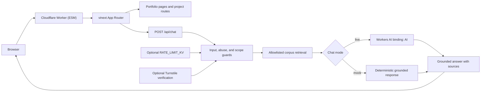
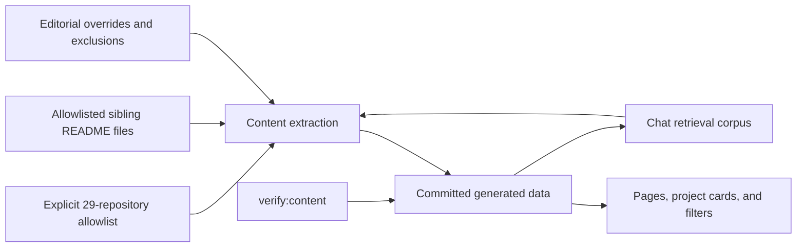

# Architecture

This portfolio is a server-rendered React application with a grounded research
chat. It is built with the bundled **vinext/Vite Cloudflare Worker starter**.
That runtime choice is deliberate and is the source of truth for local
development, builds, and deployment.

## Runtime truth

vinext reproduces the Next.js App Router programming model on Vite and React
Server Components. The project therefore keeps familiar App Router semantics:

- file-system routes under `app/`;
- server and client component boundaries;
- route handlers such as `app/api/chat/route.ts`;
- metadata, layouts, loading states, and server-side rendering.

The production artifact is a Cloudflare Worker ES module. Vite and
`@cloudflare/vite-plugin` produce the client, RSC, and SSR environments, while
`worker/index.ts` delegates application requests to
`vinext/server/app-router-entry`.

This is **not** a standard `next build`, an OpenNext conversion, or an
`@opennextjs/cloudflare` application. No OpenNext adapter or configuration
belongs in this repository. vinext has a smaller and newer compatibility
surface than mature Next.js runtimes, so new framework APIs should be verified
against the pinned vinext version before adoption.

## System view

## Build-time content flow

Portfolio content is assembled before deployment:

The application never scans arbitrary repositories at request time and never
executes sibling code. A repository outside the allowlist is not eligible for
repository-derived display or chat evidence. The five manual title-only
shortlist entries may expose only their curated rank, project number, and
title; they do not authorize repository ingestion or detailed claims. Explicit
exclusions are enforced before all other source rules.

See [Project content matrix](project-content-matrix.md) and
[Content editing](content-editing.md) for the concrete boundary and update
workflow.

## Request lifecycle

### Portfolio pages

1. The Worker receives the request.
2. vinext resolves the App Router route.
3. Server components read committed portfolio data.
4. Client components hydrate only the interactions that need browser state,
   such as filters, theme selection, and the chat composer.
5. Static assets are served through the `ASSETS` binding.

### Chat

1. The browser sends a bounded message, short recent history, and an optional
   Turnstile token to `POST /api/chat`.
2. The route validates shape and size, applies abuse controls, and rejects
   unsupported methods or content types.
3. Retrieval runs only over the committed allowlisted corpus.
4. The model prompt treats retrieved text as evidence, never as instructions.
5. Mock mode returns a deterministic response without a provider call. Live
   mode calls the `AI` Workers AI binding.
6. The response streams text and ends with structured source cards. If evidence
   is insufficient, the route narrows the answer or abstains.

The detailed policy lives in [Chat grounding](chat-grounding.md).

## Cloudflare bindings

| Binding or value       | Requirement                               | Purpose                                                        |
| ---------------------- | ----------------------------------------- | -------------------------------------------------------------- |
| `ASSETS`               | Required by the Worker entry              | Serves `dist/client` assets                                    |
| `AI`                   | Required for live chat                    | Runs the configured Workers AI model                           |
| `RATE_LIMIT_KV`        | Optional                                  | Shares rate-limit counters across Worker isolates              |
| `TURNSTILE_SECRET_KEY` | Optional, paired with the public site key | Verifies Turnstile tokens server-side                          |
| `IP_HASH_SALT`         | Recommended secret in production          | Separates one-way rate-limit keys from raw network identifiers |
| `CHAT_MOCK_MODE`       | Required configuration                    | Selects deterministic mock or live AI behavior                 |
| `AI_MODEL`             | Required in live mode                     | Names the Workers AI model                                     |

Without `RATE_LIMIT_KV`, any in-memory limiter is only best-effort per Worker
isolate and must not be described as a global quota. Without Turnstile
configuration, the chat still applies its other input and rate controls.

## Repository map

| Path                   | Responsibility                                                         |
| ---------------------- | ---------------------------------------------------------------------- |
| `app/`                 | Routes, layouts, metadata, and server request boundaries               |
| `components/`          | Reusable navigation, portfolio, project, and chat UI                   |
| `data/`                | Curated project authority, rankings, aliases, and exclusion policy     |
| `generated/`           | Derived GitHub metadata, manifests, knowledge chunks, and search index |
| `content/writing/`     | Reusable research, retrospective, and evaluation-note templates        |
| `lib/`                 | Retrieval, chat, validation, and shared server utilities               |
| `scripts/`             | Deterministic content generation and verification                      |
| `worker/index.ts`      | Cloudflare Worker entry and image handling                             |
| `vite.config.ts`       | vinext, Sites, and Cloudflare Vite integration                         |
| `wrangler.jsonc`       | Direct Cloudflare Worker deployment and bindings                       |
| `.openai/hosting.json` | Sites project metadata and managed-resource declarations               |
| `tests/`               | Content, server, render, and browser contracts                         |
| `docs/`                | Architecture, operations, content, and evaluation guidance             |

## Security and privacy boundaries

- Secrets remain server-side and are never prefixed with `NEXT_PUBLIC_`.
- The Turnstile widget is not considered protection until its token is
  validated on the server.
- Live questions and the selected evidence are sent to Workers AI for
  generation. Mock mode makes no AI inference request.
- Browser conversation history is device-local and clearable. The application
  does not need a portfolio-owned conversation database.
- Platform request logs, analytics, and provider retention remain governed by
  the configured Cloudflare account and should be reviewed before production.
- Retrieved repository prose is untrusted data. It cannot alter system rules,
  expand the allowlist, reveal secrets, or authorize tools.

## Deliberate non-goals

- Executing, importing, or benchmarking sibling repositories.
- Answering from the open web or arbitrary GitHub content at request time.
- Presenting synthetic smoke results as external scientific validation.
- Indexing biographical or organizational details outside the approved
  portfolio content boundary.
- Adding an OpenNext adapter alongside vinext.
